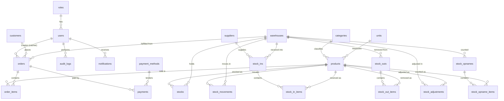

# Kasirku Mobile — Database Design (Phase 2)

MySQL schema for the POS & inventory system. All tables use the `app_` prefix
(applied automatically by the connection config in
[`backend/config/database.go`](../backend/config/database.go)); the names below
omit it. Migrations live in [`backend/database/migrations`](../backend/database/migrations),
ORM models in [`backend/app/models`](../backend/app/models).

## Entity–Relationship Diagram

## Table catalogue

| Table | Purpose (PRD) | Key columns |
| ----- | ------------- | ----------- |
| `roles` | RBAC roles §8.2 | name (unique) |
| `users` | App users §8.3 | email (unique), role_id→roles, status, last_login_at, soft-deletes |
| `categories` | Product categories §8.5 | name, status, soft-deletes |
| `units` | Units of measure | code (unique), name, soft-deletes |
| `suppliers` | Suppliers §8.6 | name, contact_person, status, soft-deletes |
| `customers` | Customers §8.7 | name, phone, status, soft-deletes |
| `warehouses` | Stock locations §8.8 | code (unique), is_default, status, soft-deletes |
| `products` | Products §8.4 | sku (unique), barcode, category_id→categories, unit_id→units, purchase/selling_price, minimum_stock, soft-deletes |
| `stocks` | Inventory level §8.9 | (product_id, warehouse_id) unique, quantity, reserved |
| `payment_methods` | Tender types §8.20 | code (unique), is_active |
| `orders` | Sales / POS §8.19, §8.21 | order_number (unique), user_id→users, customer_id→customers, warehouse_id, totals, status, soft-deletes |
| `order_items` | Order lines §8.18 | order_id→orders (cascade), product_id, snapshot name/sku, unit_price, quantity, subtotal |
| `payments` | Payments §8.20 | order_id→orders (cascade), payment_method_id, amount, amount_paid, change, status |
| `stock_movements` | Stock ledger §8.14 | product_id, warehouse_id, type (enum), quantity(±), quantity_before/after, reference_type/id, user_id |
| `stock_ins` / `stock_in_items` | Goods receiving §8.10 | reference_number (unique), supplier_id, warehouse_id; items: quantity, purchase_price |
| `stock_outs` / `stock_out_items` | Non-sale removal §8.11 | reference_number (unique), reason (enum); items: quantity |
| `stock_adjustments` | Corrections §8.12 | reference_number (unique), quantity_before/after, difference, reason |
| `stock_opnames` / `stock_opname_items` | Physical count §8.13 | reference_number (unique), status; items: system_stock, physical_stock, difference |
| `notifications` | In-app alerts §8.25 | user_id (nullable = broadcast), type, data (json), read_at |
| `audit_logs` | Audit trail §8.26 | user_id, action, module, old_data/new_data (json), ip_address |

## Design notes

- **Stock ledger.** `stocks` holds the *current* level per product/warehouse;
  `stock_movements` is the append-only history. Every operation that changes a
  stock level (sale, stock-in/out, adjustment, opname, transfer) must write a
  matching movement row — this is what makes inventory *traceable* (PRD §6).
- **Available stock** = `quantity − reserved`, computed at query time
  (`Stock.AvailableStock()` in the model), never stored.
- **Foreign keys.** Sale/receipt line items cascade-delete with their header.
  Master-data references (category, unit, warehouse) are `RESTRICT` so referenced
  records can't be deleted out from under transactions. `customer_id` on orders
  is `SET NULL`.
- **Money** columns are `DECIMAL(15,2)` to avoid floating-point drift.
- **Soft deletes** on master data and transactional headers preserve history;
  ledger tables (`stock_movements`, `audit_logs`, `notifications`) are
  append-only with a single `created_at`.
- **Snapshots.** `order_items` stores `product_name`/`sku` at sale time so
  receipts and history stay correct even if the product is later renamed.

## Seed data

`artisan db:seed` (idempotent) loads: 3 roles; 3 demo users (one per role,
password `password`); 5 categories; 5 units; 2 warehouses (Gudang Utama default);
5 payment methods; 6 sample products with initial stock in Gudang Utama.

Demo logins — `admin@kasirku.test`, `cashier@kasirku.test`,
`warehouse@kasirku.test` (all password `password`).
